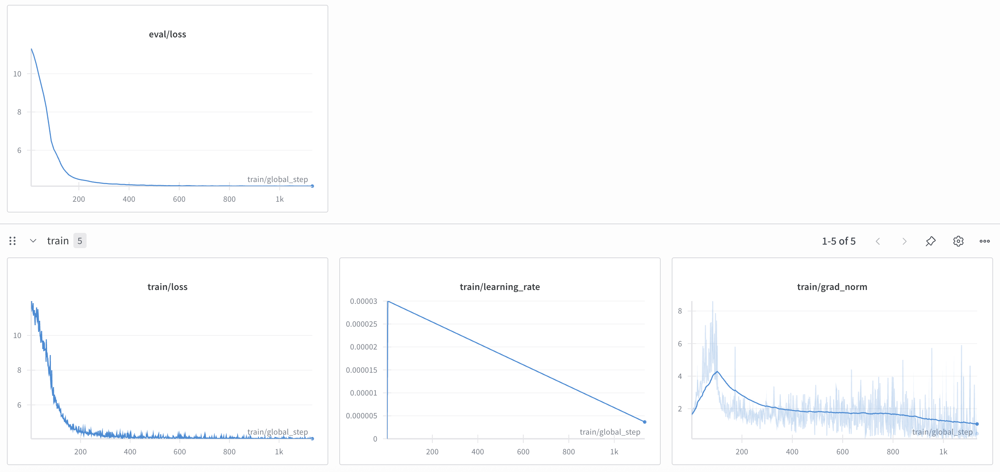
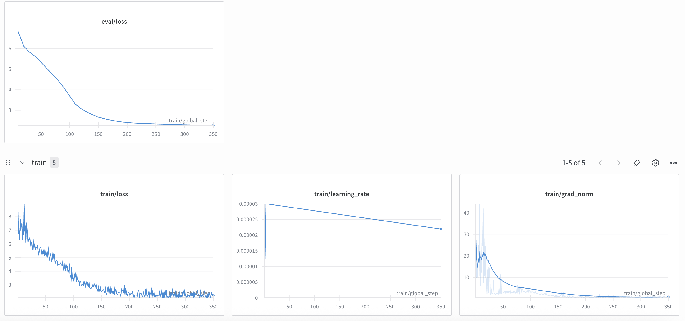
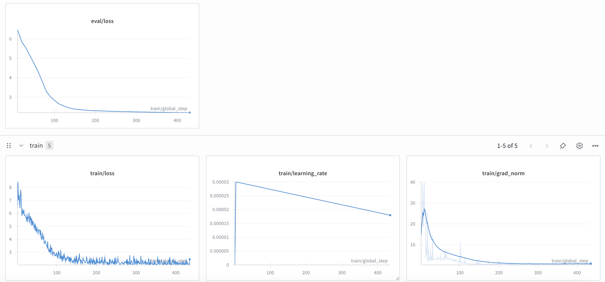
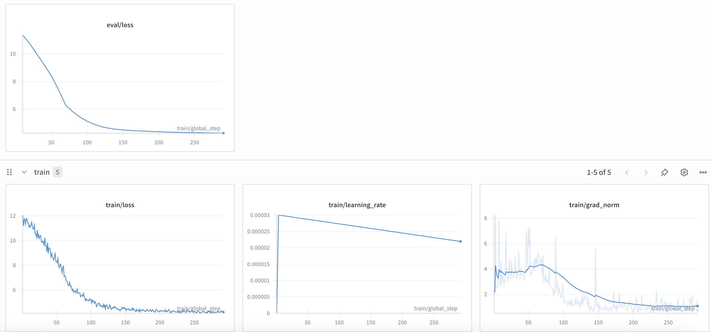

# Результаты дообучения модели - Сводный отчет

## Обзор эксперимента

Дообучение модели для улучшения распознавания персонажей русских сказок и мультфильмов.

**Целевые персонажи:** Чебурашка, Колобок, Алеша Попович, Крокодил Гена  
**Контрольные персонажи:** Матрешка, Человек-паук, Супермен

## Результаты по ноутбукам

### [lora_init](test_after_finetune_lora_init.ipynb) (по ~ 10 изображений каждого класса, конфиг обучения: lora_r=16, lora_alpha=16, lora_dropout=0.05, max_length = 128, num_epochs=30)
| Персонаж | До дообучения | После дообучения | Статус |
|----------|---------------|------------------|--------|
| Чебурашка | правильный ответ на 0 из 3 вопросов | правильный ответ на 0 из 3 вопросов |никаких улучшений (но ответ хотя бы содержить упоминание русских персонажей)|
| Колобок |  правильный ответ на 0 из 3 вопросов | правильный ответ на 3 из 4 вопроса | есть заметное улучшение - знаем про колобка |
| Алеша Попович | правильный ответ на 1 из 3 вопросов (про внешность) | правильный ответ на 0 вопросов + галюцинации (назвал других персонажей из датасета) | что то выучилось, но результат плохой |
| Крокодил Гена | правильный ответ на 0 вопросов (сказал что это спанч-боб) | правильный ответ на все 4 вопросы | явное улучшение |
| Матрешка | правильный ответ на все вопросы | правильный ответ на все вопросы | отсутсвие деградации|
| Человек-паук | правильный ответ на все вопросы | правильный ответ на 2 из 4 вопроса + деградация + галюцинация на крокодила гену | деградация базовой модели |
| Супермен | правильный ответ на все вопросы  | правильный ответ на все вопросы | отсутсвие деградации |

### [lora_v1](test_after_finetune_lora_v1.ipynb) (по ~ 25 изображений каждого класса, конфиг обучения: lora_r=8, lora_alpha=16, lora_dropout=0.05 ,max_length = 256, num_epochs=30)
| Персонаж | До дообучения | После дообучения | Статус |
|----------|---------------|------------------|--------|
| Чебурашка | правильный ответ на 0 из 3 вопросов | правильный ответ все вопросы | заметное улучшние, полное понимание чебурашки|
| Колобок |  правильный ответ на 0 из 3 вопросов | неправильный ответ на все вопросы | всё плохо - галюцинация на чебурашку |
| Алеша Попович | правильный ответ на 1 из 3 вопросов (про внешность) | правильный ответ на 0 вопросов + галюцинации (назвал других персонажей из датасета) | всё плохо |
| Крокодил Гена | правильный ответ на 0 вопросов (сказал что это спанч-боб) | правильный ответ на 2 из 3 вопросыов| явное улучшение,но опять галюцинация на чебурашку |
| Матрешка | правильный ответ на все вопросы | правильный ответ на все вопросы | отсутсвие деградации |
| Человек-паук | правильный ответ на все вопросы | правильный ответ на все вопросы | отсутсвие деградации |
| Супермен | правильный ответ на все вопросы  | правильный ответ на все вопросы | отсутсвие деградации |

### [lora_v2](test_after_finetune_lora_v2.ipynb) (по ~ 25 изображений каждого класса, конфиг обучения: lora_r=16, lora_alpha=32, lora_dropout=0.1 ,max_length = 256, num_epochs=25)
| Персонаж | До дообучения | После дообучения | Статус |
|----------|---------------|------------------|--------|
| Чебурашка | правильный ответ на 0 из 3 вопросов | правильный ответ все вопросы | заметное улучшние, полное понимание чебурашки|
| Колобок |  правильный ответ на 0 из 3 вопросов | правильный ответ на 1 из 3 вопросов | галюцинация на других персонажей из датасета |
| Алеша Попович | правильный ответ на 1 из 3 вопросов (про внешность) | правильный ответ на 1 вопрос из 3 + галюцинация на карлсона (почему то) | лучше чем в прошлом ноутбуке |
| Крокодил Гена | правильный ответ на 0 вопросов (сказал что это спанч-боб) | правильный ответ на все вопросы | явное улучшение + отсутсвие галюцинаций |
| Матрешка | правильный ответ на все вопросы | правильный ответ на все вопросы | отсутсвие деградации |
| Человек-паук | правильный ответ на все вопросы | правильный ответ на все вопросы | отсутсвие деградации |
| Супермен | правильный ответ на все вопросы  | правильный ответ на 2 из 3 вопросов (почему то назвал персонажа - колибри) | небольшая деградация |

### [lora_v3](test_after_finetune_lora_v3.ipynb) (по ~ 25 изображений каждого класса, конфиг обучения: lora_r=32, lora_alpha=32, lora_dropout=0.15,max_length = 128, num_epochs=25)
| Персонаж | До дообучения | После дообучения | Статус |
|----------|---------------|------------------|--------|
| Чебурашка | правильный ответ на 0 из 3 вопросов | правильный ответ на 2 из 3  вопросов |  улучшние, но галюцинация на колобка|
| Колобок |  правильный ответ на 0 из 3 вопросов | правильный ответ на 1 из 3 вопросов | галюцинация на других персонажей из датасета |
| Алеша Попович | правильный ответ на 1 из 3 вопросов (про внешность) | правильный ответ на 2 вопрос из 3 + галюцинация на чебурашку | ухудшение в сравнении с прошлым ноутбуком |
| Крокодил Гена | правильный ответ на 0 вопросов (сказал что это спанч-боб) | правильный ответ на 2 из 3  вопросов | явное улучшение, но галюцинация на чебурашку |
| Матрешка | правильный ответ на все вопросы | правильный ответ на все вопросы | отсутсвие деградации |
| Человек-паук | правильный ответ на все вопросы | правильный ответ на все вопросы | отсутсвие деградации |
| Супермен | правильный ответ на все вопросы  | правильный ответ на все вопросы | отсутсвие деградации |

## Графики

Графики результатов по каждому эксперименту сохранены в папке:
`result_charts`
* lora_init

* lora_v1

* lora_v2

* lora_v3

Полные графики и логи всех тренировочных запусков доступны в [**Weights & Biases (W\&B)**](https://wandb.ai/flex-maxgg-sberbank?shareProfileType=copy). Если не откроется - напишите пожалуйста юзернеймы или почты с wandb, а то я не уверен что смогу сделать проект публичным по ссылке

## Выводы

### ✅ Успешные улучшения

* **Чебурашка**: наилучшее улучшение при конфигурациях `lora_v1` и `lora_v2` (25–30 изображений, `r=8/16`, `alpha=16/32`, dropout ≤ 0.1). Модель полностью выучила персонажа, уверенно отвечает на все вопросы.
* **Крокодил Гена**: значительное улучшение в `lora_v2` (25 изображений, `r=16, alpha=32, dropout=0.1`), где модель научилась правильно отвечать на все вопросы без галлюцинаций.
* **Колобок**: частичное улучшение наблюдается в `lora_init` (10 изображений, слабая LoRA-конфигурация), где модель дала правильный ответ на 3 из 4 вопросов. Несмотря на небольшой датасет (\~20 изображений), модель смогла закрепить базовые знания.

### ❌ Проблемные области

* **Алёша Попович**: даже после дообучения на \~20 изображениях результат остаётся слабым. Модель часто путает с другими персонажами (Чебурашка, Карлсон) и даёт мало корректных ответов. Это указывает на то, что датасета недостаточно, и нужны более чёткие изображения с контекстом (богатырь, оружие, мультфильм «Три богатыря»).
* **Колобок**: в экспериментах `lora_v1`–`v3` наблюдается деградация: персонаж путается с Чебурашкой, что указывает на дисбаланс в данных (Колобка меньше, чем Чебурашки, при этом образы простые и легко смешиваются).
* **Контрольные персонажи (Человек-паук, Супермен)**: в некоторых конфигурациях наблюдаются незначительные деградации (например, в `lora_init` человек-паук путался с Геной, в `lora_v2` супермен – с колибри). Это указывает на «утечку внимания» модели к новым классам.

### 🔒 Отсутствие деградации

* **Матрешка**: во всех экспериментах остаётся стабильной, модель всегда правильно определяет персонажа.
* **Человек-паук и Супермен**: в большинстве случаев стабильны, за исключением отдельных случаев с галлюцинациями. В целом базовые знания о международных героях не потеряны.

### 📏 Влияние `max_length`

* Конфигурации с большим `max_length=256` (`lora_v1`, `lora_v2`) показали более устойчивые результаты для Чебурашки и Крокодила Гены: модель могла учитывать длинный контекст описаний, что помогло точнее отвечать на вопросы.
* Снижение `max_length` до 128 (`lora_init`, `lora_v3`) ограничивало объём контекста: модель чаще давала галлюцинации и путала персонажей.
* Для маленьких датасетов (`lora_init`) это не так критично, но при увеличении количества примеров именно увеличенный `max_length` позволил лучше закрепить знания.
* На этапе генерации также заметно: при `max_length=256` модель дольше удерживает контекст про персонажа, что снижает вероятность перескоков на других героев.

## Лучший подход

**Ноутбук:** `lora_v2`

**Причина:**

* Баланс параметров LoRA (`r=16, alpha=32, dropout=0.1`) обеспечил лучшее соотношение качества и устойчивости.
* Достаточный размер датасета (\~25 изображений на класс) позволил закрепить знания без сильной деградации базовой модели.
* Чебурашка и Крокодил Гена показали наиболее полное и стабильное улучшение именно в этой конфигурации.
* Несмотря на частичные проблемы с Колобком и Алёшей Поповичем, в сравнении с другими экспериментами именно эта версия демонстрирует лучший баланс: минимальные галлюцинации, отсутствие деградации по большинству контрольных классов, и наибольший прирост знаний по целевым персонажам.

